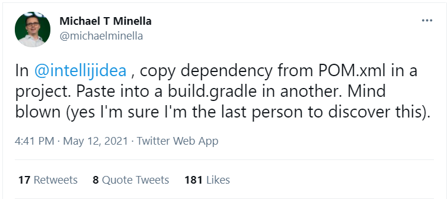
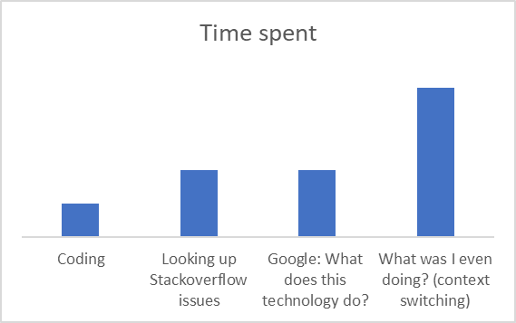

== 💡 Why customize IDE ?

=== 👩 👦 Human nature

. We customize everything - key chains to cars!
. Sense of ownership.
. Increase productivity.
. Aesthetically more appealing or is just convenient.
{nbsp} +
{nbsp} +
{nbsp} +

'''

=== 🔨 💪 Tools empower developers

. Tools help speed up the software development process.
. Tools should help you focus on the business problem you are solving, not have you worry about anything else.
. Using the right tool for the job only helps you so much, knowing how you can use it or customize it further, will enhance your experience even more!

{nbsp} +
{nbsp} +
{nbsp} +

'''

=== 💻 Personalization for you or for your company

.Problem: Developer's productivity
//image::docs/image_context_switching_darcula.png[]

//We spend most of our time in our IDE, a percentage of the time that we spend elsewhere is usually the time when we are on our browser, third-party tools - ticket tracking system, CI/CD frameworks, etc.This quickly adds up, this is where the customizing IDE shines through.

. We are all different, and our preferences are different.
. We all work for companies that have different coding guidelines and frameworks.
. Frameworks that are unique to you or to your company, for which there is no plugin in the Open Source marketplace.
. Workflows that are unique to you or to your company, version control and CI/CD hooks.
. Tasks that are repetitive.

{nbsp} +

* 💡 link:../Make_IntelliJ_IDEA_your_own.adoc[Main]
* ➡ link:What_customizations_are_possible.adoc[Next]
